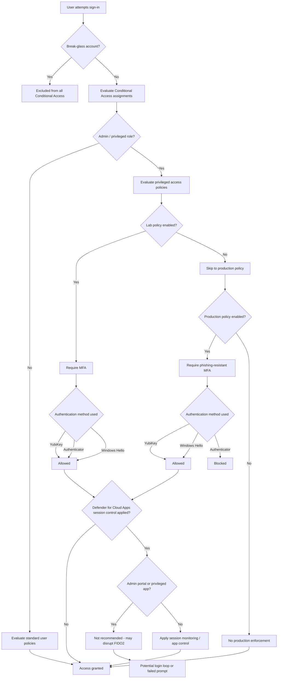
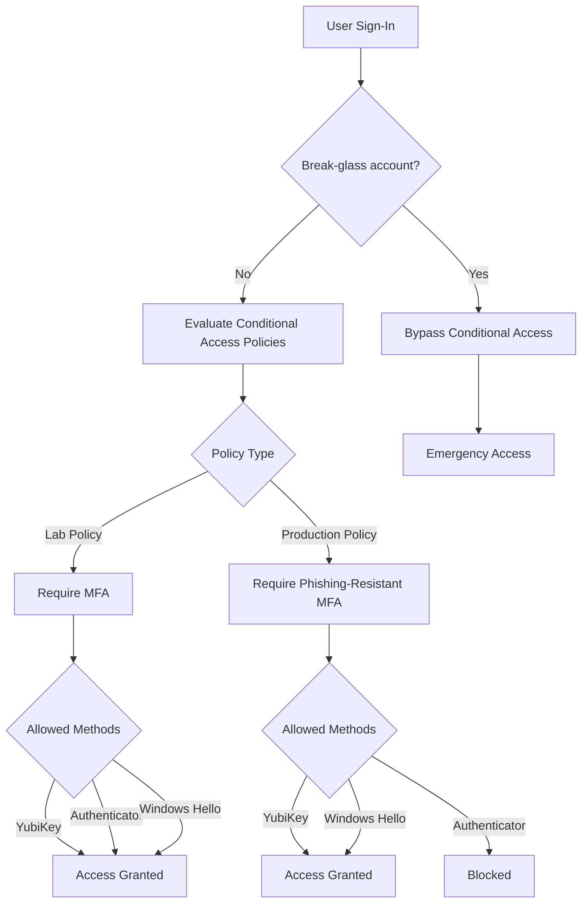

# 🔐 Entra Phishing-Resistant MFA Implementation Guide

A practical, production-ready guide to implementing phishing-resistant MFA in Microsoft Entra using Conditional Access, authentication strengths, and FIDO2 (YubiKey/passkeys).

---

## 👥 Who This Is For

* Security engineers
* Identity architects
* Microsoft 365 administrators
* Organizations implementing Zero Trust

---

## 📚 Table of Contents

* [Why This Matters](#-why-this-matters)
* [The Problem](#-the-problem)
* [The Solution](#-the-solution)
* [Deployment Guide](#-deployment-guide-step-by-step)
* [Validation](#-validation--testing-summary)
* [Common Mistakes](#-common-mistakes)
* [Real-World Use Cases](#-real-world-use-cases)
* [Rollout Strategy](#-recommended-rollout-strategy)
* [Next Steps](#-next-steps)

---

## ⚠️ Why This Matters

Traditional MFA methods (SMS, push notifications, OTP) are vulnerable to:

* Adversary-in-the-Middle (AiTM) phishing attacks
* MFA fatigue / push bombing
* Token theft and replay

Phishing-resistant MFA (FIDO2, Windows Hello for Business, certificate-based authentication) eliminates these risks by binding authentication to the device and origin.

---

## 🚨 The Problem

Many organizations believe MFA is sufficient—but:

* Attackers can intercept MFA tokens
* Push fatigue attacks trick users into approving access
* Session hijacking bypasses MFA entirely

This leaves privileged accounts exposed even with MFA enabled.

---

## 🛡️ The Solution

Microsoft Entra provides **authentication strengths** that enforce phishing-resistant methods:

* FIDO2 (YubiKey / passkeys)
* Windows Hello for Business
* Certificate-based authentication

Combined with Conditional Access, these ensure:

* Only strong authentication methods are allowed
* Weak MFA methods are blocked

---

## ⚙️ Deployment Guide (Step-by-Step)

> [!TIP]
> Follow this guide step-by-step.
> Do not skip validation steps before enabling policies.

---

## 🔄 Policy Interaction Diagram



---

## 🧭 Authentication Flow Overview



---

## ⚠️ Before You Start

This guide assumes:

* You have Global Administrator access
* A break-glass account is created and excluded from Conditional Access
* You are testing in a controlled or lab environment
* Misconfiguration may result in administrative lockout

---

## ☁️ Defender for Cloud Apps Considerations

> [!IMPORTANT]
> Defender for Cloud Apps session controls can interfere with phishing-resistant authentication if not configured carefully.

### 🧠 Key Concept

Microsoft Defender for Cloud Apps acts as a proxy when session controls are applied.

This means:

* Authentication traffic may be intercepted
* FIDO2 (YubiKey) flows can be impacted

---

## ⚠️ Known Risks

If you enable Conditional Access App Control (session control), you may experience:

* YubiKey prompts failing
* Authentication loops
* Unexpected sign-in behavior
* Inconsistent MFA prompts

### 🚫 Do NOT apply session controls to:

* Microsoft Entra admin center
* Azure portal
* Microsoft 365 admin center

👉 These are critical admin surfaces and must remain stable

---

### ✅ Recommended Approach

1. **Exclude Admin Roles from Session Control**

   * Global Administrator
   * Privileged roles

2. **Use App Control Selectively**

   * High-risk SaaS apps
   * Non-admin scenarios

3. **Test Before Enforcing**

   * Validate YubiKey sign-in
   * Test browser + device login

4. **Monitor Sign-in Behavior**

   * Entra sign-in logs
   * Defender for Cloud Apps logs

---

## 🔍 Troubleshooting Indicators

| Symptom                        | Possible Cause               |
| ------------------------------ | ---------------------------- |
| YubiKey prompt does not appear | Session proxy interfering    |
| Infinite login loop            | App control misconfiguration |
| MFA prompts inconsistent       | Policy conflict              |

---

## ⚡ Design Principle

Authentication should be strong and direct.
Session control should be selective and post-authentication.

---

## 📚 Supporting Documents

* Prerequisites
* YubiKey Enrollment

---

## 🧰 Step 1 — Environment Setup

```powershell
$PSVersionTable.PSVersion
```

```powershell
Set-ExecutionPolicy RemoteSigned -Scope CurrentUser

Install-Module Microsoft.Graph.Authentication -Scope CurrentUser
Install-Module Microsoft.Graph.Identity.SignIns -Scope CurrentUser

Connect-MgGraph -Scopes `
  "Policy.Read.All", `
  "Policy.ReadWrite.ConditionalAccess", `
  "Application.Read.All", `
  "Policy.ReadWrite.AuthenticationMethod"
```

```powershell
Get-MgContext
```

---

## 🚀 Step 2 — Execute Deployment Scripts

```powershell
.\scripts\00-install-modules.ps1
.\scripts\01-connect-graph.ps1
```

---

## ✅ What Success Looks Like

* Lab policy allows fallback (Authenticator)
* Production policy blocks weak MFA
* YubiKey authentication succeeds
* Break-glass account bypasses policies

---

## ⚠️ Critical Safety Checks

* YubiKey is registered
* Backup key available
* Break-glass account verified
* Logs reviewed

---

## 🛠️ Troubleshooting

* Ensure Graph scopes are granted
* Verify admin role permissions
* Use supported browser (Edge/Chrome)
* Use break-glass account if locked out

---

## 🧠 Key Concepts

| Phase      | Behavior                        |
| ---------- | ------------------------------- |
| Lab        | MFA allows fallback             |
| Production | Only phishing-resistant allowed |

---

## ⚡ Best Practices

* Start in report-only mode
* Never remove fallback too early
* Always test before enforcement
* Maintain recovery path
* Issue multiple YubiKeys

---

## 🧪 Validation & Testing (Summary)

* Confirm phishing-resistant MFA is enforced
* Validate fallback is blocked
* Review sign-in logs

---

## ⚠️ Common Mistakes

* Not excluding break-glass accounts
* Enabling production too early
* Misconfiguring authentication strengths
* Applying session controls to admin portals

---

## 🧠 Real-World Use Cases

* Securing privileged accounts
* Enforcing Zero Trust
* Protecting remote workforce

---

## 🚦 Recommended Rollout Strategy

1. Start with report-only mode
2. Deploy to a pilot group
3. Validate authentication behavior
4. Expand to privileged users
5. Enforce production policy

Never enforce globally without validation.

---

## 🚀 Next Steps

* Integrate Identity Protection
* Expand Zero Trust architecture
* Monitor with KQL and sign-in logs

---

## ⚠️ Disclaimer

This tool is provided for **educational, testing, and security validation purposes only**.

Use of this tool should be limited to:
- Authorized environments  
- Lab or approved enterprise systems  

The author assumes **no liability or responsibility** for:
- Misuse of this tool  
- Damage to systems  
- Unauthorized or improper use  

By using this tool, you agree to use it in a lawful and responsible manner.
---

This project is not affiliated with or endorsed by Microsoft.
---


## ⚖️ Professional Disclaimer

This project is an independent work developed in a personal capacity.

The views, opinions, code, and content expressed in this repository are solely my own and do not reflect the views, policies, or positions of any current or future employer, client, or affiliated organization.

No employer, past, present, or future, has reviewed, approved, endorsed, or is in any way associated with these works.

This project was developed outside the scope of any employment and without the use of proprietary, confidential, or restricted resources.

All code/language in this repository is provided under the terms of the included MIT License.


