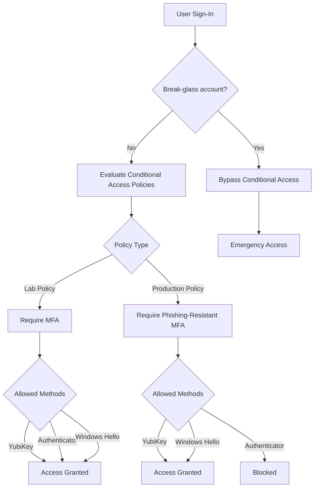

# 🔐 Entra Phishing-Resistant MFA Deployment Guide

> [!TIP]
> Follow this guide step-by-step.  
> Do not skip validation steps before enabling policies.

A complete, end-to-end process for deploying phishing-resistant MFA using YubiKeys (FIDO2/passkeys) in Microsoft Entra ID.

---

## 🧭 Authentication Flow Overview



## ⚠️ Before You Start

This guide assumes:

- You have Global Administrator access
- A break-glass account is created and excluded from Conditional Access
- You are testing in a controlled or lab environment
- Misconfiguration may result in administrative lockout

---

## 📚 Supporting Documents

Prerequisites
YubiKey Enrollment

## 🧰 Step 1 — Environment Setup

Install PowerShell 7

```Powershell
$PSVersionTable.PSVersion
```

You should see version 7.x or higher.

If not installed:
https://github.com/PowerShell/PowerShell

---

```Powershell
Set Execution Policy
Set-ExecutionPolicy RemoteSigned -Scope CurrentUser
Install Required Modules
Install-Module Microsoft.Graph.Authentication -Scope CurrentUser
Install-Module Microsoft.Graph.Identity.SignIns -Scope CurrentUser
Connect to Microsoft Graph
Connect-MgGraph -Scopes `
  "Policy.Read.All", `
  "Policy.ReadWrite.ConditionalAccess", `
  "Application.Read.All", `
  "Policy.ReadWrite.AuthenticationMethod"'
```

Verify Connection

```Powershell
Get-MgContext
```

---

## 🚀 Step 2 — Execute Deployment Scripts

### Running Scripts

You can run scripts from either location:

Option 1 — From scripts folder
cd .\scripts
.\00-install-modules.ps1

Option 2 — From repository root (recommended)
.\scripts\00-install-modules.ps1

### Install Modules Script

Script:
00-install-modules.ps1

.\00-install-modules.ps1
Connect to Graph Script

Script:
01-connect-graph.ps1

.\01-connect-graph.ps1
Identify Break-Glass Account

Script:
02-get-breakglass-user.ps1

.\02-get-breakglass-user.ps1 -UserPrincipalName "breakglass@yourtenant.onmicrosoft.com"

📌 Copy:

id → BreakGlassObjectId
Review FIDO2 Configuration (Optional)

Script:
04-enable-fido2-template.ps1

.\04-enable-fido2-template.ps1 -WhatIf
Create Lab Conditional Access Policy

Script:
05-create-ca-privileged-lab.ps1

.\05-create-ca-privileged-lab.ps1 -BreakGlassObjectId "<object-id>"
Expected Result
Policy created in Report-only mode
Allows:
YubiKey
Microsoft Authenticator (fallback)
Test Authentication

Verify:

New browser session
Sign-in options available
YubiKey authentication works
Authenticator fallback works
Get Authentication Strength ID

Script:
03-get-authentication-strengths.ps1

.\03-get-authentication-strengths.ps1

Find:

Phishing-resistant MFA

📌 Copy the id

Create Phishing-Resistant Policy

Script:
06-create-ca-privileged-phishing-resistant.ps1

.\06-create-ca-privileged-phishing-resistant.ps1 `
  -BreakGlassObjectId "<object-id>" `
  -AuthenticationStrengthId "<strength-id>"
Expected Result
Policy created in Report-only mode
Enforces:
YubiKey
Windows Hello
Blocks:
Microsoft Authenticator
Validate in Sign-in Logs

Navigate to:

Entra → Sign-in logs

Confirm:

Policy evaluation occurred
Correct authentication method used
✅ What Success Looks Like
Lab policy allows both YubiKey and Authenticator
Phishing-resistant policy blocks Authenticator
YubiKey authentication succeeds consistently
Break-glass account bypasses all Conditional Access policies
Enable Policy

Script:
07-set-ca-policy-state.ps1

.\07-set-ca-policy-state.ps1 `
  -DisplayName "CA - Privileged - Require Phishing-Resistant MFA" `
  -State enabled
⚠️ Critical Safety Checks
✅ YubiKey is registered and working
✅ Backup key is available (recommended)
✅ Break-glass account is verified
✅ Sign-in logs have been reviewed
🛟 Recovery Options
<details> <summary><strong>Expand recovery guidance</strong></summary>

If access is lost:

Use break-glass account
Use Temporary Access Pass (TAP)
Re-register authentication methods
</details>
🛠️ Troubleshooting
Cannot connect to Graph
Ensure required scopes are granted
Re-run Connect-MgGraph
Script fails with permission error
Verify Global Administrator role
Confirm admin consent was granted
YubiKey not prompting
Use supported browser (Edge or Chrome)
Ensure FIDO2/passkeys are enabled in Entra
Locked out
Use break-glass account
Use Temporary Access Pass (TAP)
🧠 Key Concepts
Phase	Behavior
Lab	MFA allows fallback (Authenticator permitted)
Production	Only phishing-resistant methods allowed
⚡ Best Practices
<details> <summary><strong>Expand best practices</strong></summary>
Always start in Report-only mode
Never remove fallback too early
Always test before enforcement
Maintain at least one recovery path
Issue at least two YubiKeys for privileged users
</details> ```
