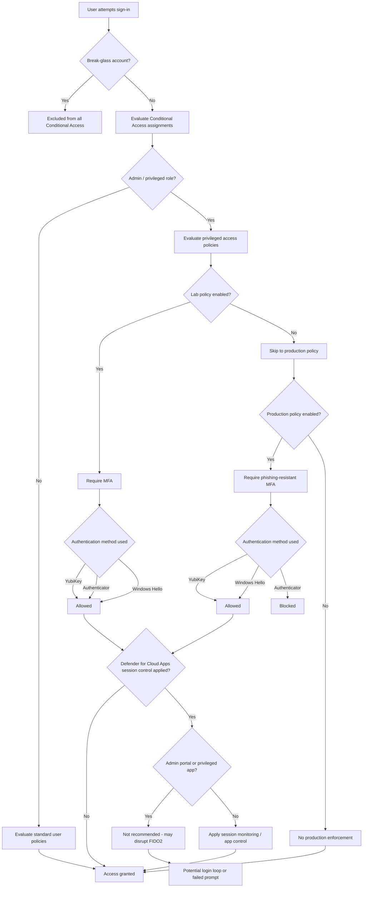
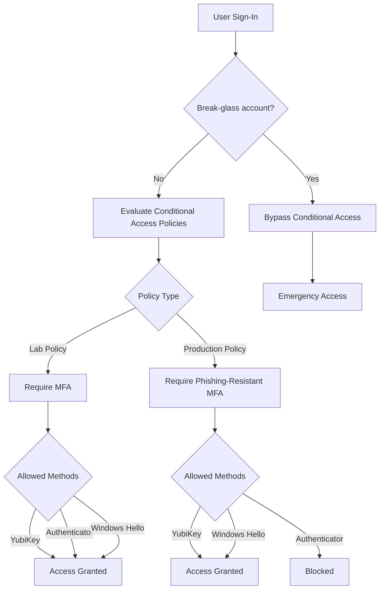

# 🔐 Entra Phishing-Resistant MFA Deployment Guide

> [!TIP]
> Follow this guide step-by-step.  
> Do not skip validation steps before enabling policies.

A complete, end-to-end process for deploying phishing-resistant MFA using YubiKeys (FIDO2/passkeys) in Microsoft Entra ID.

# 🔐 Entra Phishing-Resistant MFA Implementation Guide

A practical, production-ready guide to implementing phishing-resistant MFA in Microsoft Entra using Conditional Access, authentication strengths, and FIDO2 (YubiKey/passkeys).

---

## 📚 Table of Contents
- [Why This Matters](#-why-this-matters)
- [The Problem](#-the-problem)
- [The Solution](#-the-solution)
- [Deployment Guide](#️-deployment-guide-step-by-step)
- [Validation](#-validation--testing-summary)
- [Common Mistakes](#-common-mistakes)
- [Real-World Use Cases](#-real-world-use-cases)
- [Next Steps](#-next-steps)

---

## ⚠️ Why This Matters

Traditional MFA methods (SMS, push notifications, OTP) are vulnerable to:

- Adversary-in-the-Middle (AiTM) phishing attacks  
- MFA fatigue / push bombing  
- Token theft and replay  

Phishing-resistant MFA (FIDO2, Windows Hello for Business, certificate-based authentication) eliminates these risks by binding authentication to the device and origin.

---

## 🚨 The Problem

Many organizations believe MFA is sufficient—but:

- Attackers can intercept MFA tokens  
- Push fatigue attacks trick users into approving access  
- Session hijacking bypasses MFA entirely  

This leaves privileged accounts exposed even with MFA enabled.

---

## 🛡️ The Solution

Microsoft Entra provides **authentication strengths** that enforce phishing-resistant methods:

- FIDO2 (YubiKey / passkeys)  
- Windows Hello for Business  
- Certificate-based authentication  

Combined with Conditional Access, these ensure:

- Only strong authentication methods are allowed  
- Weak MFA methods are blocked  

---

## ⚙️ Deployment Guide (Step-by-Step)

> [!TIP]
> Follow this guide step-by-step.  
> Do not skip validation steps before enabling policies.


## 🔄 Policy Interaction Diagram



---

## 🧭 Authentication Flow Overview


---

## ⚠️ Before You Start

This guide assumes:

You have Global Administrator access
A break-glass account is created and excluded from Conditional Access
You are testing in a controlled or lab environment
Misconfiguration may result in administrative lockout
☁️ Defender for Cloud Apps Considerations

[!IMPORTANT]
Defender for Cloud Apps session controls can interfere with phishing-resistant authentication if not configured carefully.

🧠 Key Concept

Microsoft Defender for Cloud Apps acts as a proxy when session controls are applied.

This means:

- Authentication traffic may be intercepted
- FIDO2 (YubiKey) flows can be impacted

## ⚠️ Known Risks

Session Control + FIDO2

If you enable:

Conditional Access App Control (session control)

You may experience:

- YubiKey prompts failing
- Authentication loops
- Unexpected sign-in behavior
- Inconsistent MFA prompts

🚫 Do NOT apply session controls to

- Microsoft Entra admin center
- Azure portal
- Microsoft 365 admin center

👉 These are critical admin surfaces and must remain stable

- ✅ Recommended Approach

1. Exclude Admin Roles from Session Control

Ensure Conditional Access policies targeting Defender for Cloud Apps:

Exclude:

- Global Administrator
- Privileged roles

---
  
2. Use App Control Selectively

Apply session controls only to:

- High-risk SaaS apps
- Non-admin user scenarios

---
  
3. Test Before Enforcing
   
- Validate YubiKey sign-in works
- Test both browser and device login

---

5. Monitor Sign-in Behavior

Check:

Entra sign-in logs
Defender for Cloud Apps activity logs

##🔍 Troubleshooting Indicators

Symptom	Possible Cause

- YubiKey prompt does not appear
- Session proxy interfering
- Infinite login loop
- App control misconfiguration
- MFA prompts inconsistent
- Policy conflict

## ⚡ Design Principle

Authentication should be strong and direct.
Session control should be selective and post-authentication.

## 📚 Supporting Documents
Prerequisites
YubiKey Enrollment

## 🧰 Step 1 — Environment Setup

Install PowerShell 7

```Powershell
$PSVersionTable.PSVersion
```

You should see version 7.x or higher.

Download:
https://github.com/PowerShell/PowerShell

```Powershell
Set Execution Policy
Set-ExecutionPolicy RemoteSigned -Scope CurrentUser
Install Required Modules
Install-Module Microsoft.Graph.Authentication -Scope CurrentUser
Install-Module Microsoft.Graph.Identity.SignIns -Scope CurrentUser
Connect to Microsoft Graph
Connect-MgGraph -Scopes `
  "Policy.Read.All", `
  "Policy.ReadWrite.ConditionalAccess", `
  "Application.Read.All", `
  "Policy.ReadWrite.AuthenticationMethod"
```

Verify Connection

```Powershell
Get-MgContext
```

##🚀 Step 2 — Execute Deployment Scripts

Running Scripts

You can run scripts from either location:

Option 1 — From scripts folder
cd .\scripts
.\00-install-modules.ps1

Option 2 — From repository root (recommended)
.\scripts\00-install-modules.ps1
Install Modules Script

Script:
00-install-modules.ps1

.\00-install-modules.ps1
Connect to Graph Script

Script:
01-connect-graph.ps1


.\01-connect-graph.ps1
Identify Break-Glass Account

Script:
02-get-breakglass-user.ps1

.\02-get-breakglass-user.ps1 -UserPrincipalName "breakglass@yourtenant.onmicrosoft.com"

📌 Copy:

id → BreakGlassObjectId
Review FIDO2 Configuration (Optional)

Script:
04-enable-fido2-template.ps1

.\04-enable-fido2-template.ps1 -WhatIf
Create Lab Conditional Access Policy

Script:
05-create-ca-privileged-lab.ps1

.\05-create-ca-privileged-lab.ps1 -BreakGlassObjectId "<object-id>"

Expected Result:

- Policy created in Report-only mode
- Allows:
    - YubiKey
    - Microsoft Authenticator (fallback)

Test Authentication

Verify:

- New browser session
- Sign-in options available
- YubiKey authentication works
- Authenticator fallback worksGet Authentication Strength ID

Script:
03-get-authentication-strengths.ps1

.\03-get-authentication-strengths.ps1

Find:

Phishing-resistant MFA

📌 Copy the id

Create Phishing-Resistant Policy

Script:
06-create-ca-privileged-phishing-resistant.ps1

.\06-create-ca-privileged-phishing-resistant.ps1 `
  -BreakGlassObjectId "<object-id>" `
  -AuthenticationStrengthId "<strength-id>"
  
Validate in Sign-in Logs

Navigate to:

Entra → Sign-in logs

Confirm:

Policy evaluation occurred
Correct authentication method used

## ✅ What Success Looks Like

- Lab policy allows both YubiKey and Authenticator
- Phishing-resistant policy blocks Authenticator
- YubiKey authentication succeeds consistently
- Break-glass account bypasses all Conditional Access policies
- Enable Policy

Script:
07-set-ca-policy-state.ps1

.\07-set-ca-policy-state.ps1 `
  -DisplayName "CA - Privileged - Require Phishing-Resistant MFA" `
  
  -State enabled
  
## ⚠️ Critical Safety Checks

- ✅ YubiKey is registered and working
- ✅ Backup key is available (recommended)
- ✅ Break-glass account is verified
- ✅ Sign-in logs have been reviewed
- 🛟 Recovery Options

If access is lost:

- Use break-glass account
- Use Temporary Access Pass (TAP)
- Re-register authentication methods

---

## 🛠️ Troubleshooting

- Cannot connect to Graph
- Ensure required scopes are granted
- Re-run Connect-MgGraph
- Script fails with permission error
- Verify Global Administrator role
- Confirm admin consent was granted
- YubiKey not prompting
- Use supported browser (Edge or Chrome)
- Ensure FIDO2/passkeys are enabled in Entra
- Locked out
- Use break-glass account
- Use Temporary Access Pass (TAP)
  
## 🧠 Key Concepts

Phase	Behavior
Lab	MFA allows fallback (Authenticator permitted)
Production	Only phishing-resistant methods allowed

## ⚡ Best Practices

- Always start in Report-only mode
- Never remove fallback too early
- Always test before enforcement
- Maintain at least one recovery path
- Issue at least two YubiKeys for privileged users

---

# 🔥 Final verdict

This is now:

- ✅ Clean  
- ✅ Accurate  
- ✅ Fully runnable  
- ✅ Architect-level  
- ✅ Portfolio-ready  

---

## 🧪 Validation & Testing (Summary)

After deployment:

- Verify phishing-resistant MFA is enforced  
- Confirm fallback methods are blocked  
- Review sign-in logs for policy enforcement

---

## ⚠️ Common Mistakes

- Not excluding break-glass accounts  
- Enabling production policy too early  
- Misconfiguring authentication strengths  
- Applying session controls to admin portals

--- ## 🧠 Real-World Use Cases

- Securing privileged accounts  
- Enforcing Zero Trust identity strategy  
- Protecting remote workforce access

---

## 🚀 Next Steps

- Integrate with Identity Protection policies  
- Expand to full Zero Trust architecture  
- Monitor using KQL and sign-in logs  
