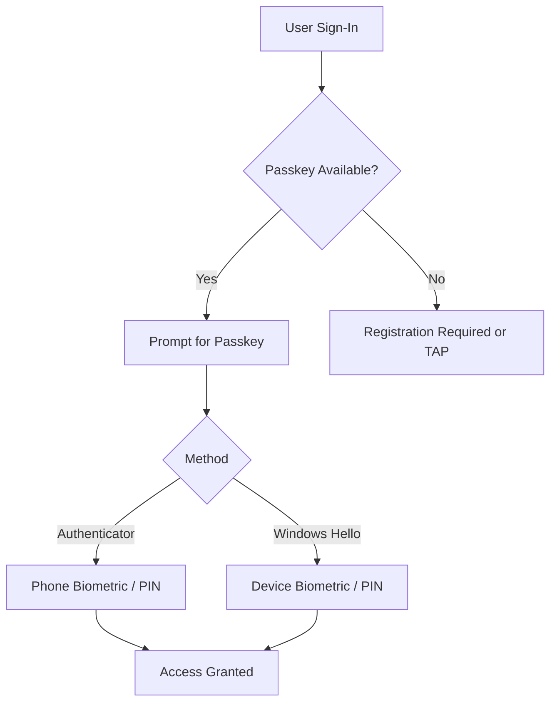

# 🔐 Entra Passwordless Deployment Guide (Passkeys)

> [!TIP]
> Follow this guide step-by-step.  
> Do not enforce policies until validation is complete.

---

## 🧭 Authentication Flow Overview



---

# ⚠️ Before You Start

This guide assumes:

- Global Administrator access
- Break-glass account is configured and excluded
- Users have a supported mobile device for Microsoft Authenticator passkeys  
- Windows Hello for Business is optional but recommended on supported Windows devices  
- Microsoft Authenticator is installed  
- Testing is performed in a controlled environment

---

# 🧠 Platform Authentication Options

This deployment supports multiple passkey methods:

- Microsoft Authenticator passkeys
- Windows Hello for Business

### Requirement

- Microsoft Authenticator passkeys are supported for this deployment
- Windows Hello for Business is **recommended but not required**

### Why Windows Hello is recommended

Windows Hello provides:

- Device-based passkey authentication
- Better user experience on managed Windows devices
- Redundancy if the user’s phone is unavailable

---

## 🧠 Key Concept

Passkeys provide:

- Phishing-resistant authentication
- Passwordless sign-in
- Device-bound credentials

They satisfy strong authentication requirements without traditional MFA prompts.

---

# ⚙️ Step 1 — Enable Passkeys in Microsoft Entra ID

This step enables passkeys (FIDO2) in Microsoft Entra ID so users can register and use passkeys.

> [!IMPORTANT]
> For this deployment, **Microsoft Authenticator passkeys are the primary required path**.  
> **Windows Hello for Business is recommended but not required**.

Microsoft’s current guidance puts passkey/FIDO2 configuration in Microsoft Entra admin center → Entra ID → Security → Authentication methods → Policies, and enabling passkey profiles moves the global FIDO2 settings into a Default passkey profile. Microsoft also documents passkeys in Authenticator as a supported phishing-resistant authentication method

---

### Option A — GUI (Recommended)

Use the Microsoft Entra admin center to enable passkeys.

#### Prerequisites

- You must sign in with a role that can manage authentication methods, such as:
  - Global Administrator
  - Authentication Policy Administrator

#### Steps

1. Sign in to the **Microsoft Entra admin center**
2. Go to:

   **Entra ID** → **Security** → **Authentication methods** → **Policies**

3. Open the **Passkey (FIDO2)** policy

4. If prompted to enable **passkey profiles**, enable them

   - Microsoft automatically moves existing global FIDO2 settings into the **Default passkey profile**

5. In the passkey profile or policy, set the method to:

   - **Enable**

6. Choose who can use passkeys:

   - **All users**, or
   - **Selected users / groups**

   > Recommended: start with a pilot group first

7. Review optional settings such as:

   - Attestation enforcement
   - Key restrictions / passkey provider restrictions
   - User self-service behavior

8. Save the policy

#### Expected Result

- Passkeys are enabled in the tenant
- Assigned users can register passkeys
- Microsoft Authenticator passkeys can be used for sign-in
- Windows Hello can also be used where supported, but it is optional for this deployment

---

### Option B — PowerShell / Graph

Use this if you want to enable passkeys programmatically.

#### Where to run it

Run this from:

- **PowerShell 7+**
- On an admin workstation
- After connecting to Microsoft Graph with the required scopes

#### Before you run it

Open **PowerShell 7** and connect to Microsoft Graph:

```powershell
Connect-MgGraph -Scopes `
  "Policy.Read.All", `
  "Policy.ReadWrite.AuthenticationMethod"
```
Verify your connection:

```powershell
Get-MgContext
```

Run the enable-passkeys command

```powershell
Invoke-MgGraphRequest `
  -Method PATCH `
  -Uri "https://graph.microsoft.com/v1.0/authenticationMethodsPolicy/authenticationMethodConfigurations/fido2" `
  -Body '{"state":"enabled"}' `
  -ContentType "application/json"
Optional: verify the current configuration first
Invoke-MgGraphRequest `
  -Method GET `
  -Uri "https://graph.microsoft.com/v1.0/authenticationMethodsPolicy/authenticationMethodConfigurations/fido2"
```
  
Expected Result:

- The tenant FIDO2 / passkey authentication method is enabled
- Users targeted by policy can begin registering passkeys
- Recommended Deployment Guidance

For this deployment:

- Required path: Microsoft Authenticator passkeys
- Optional but recommended: Windows Hello for Business
- Why Windows Hello is recommended

Windows Hello adds:

- Device-based authentication on managed Windows devices
- Better user experience for Windows users
- Redundancy if a phone is unavailable
- Why it is not required

Users can successfully use passkeys with:

- Microsoft Authenticator on a supported mobile device
- Phone biometric or PIN

This means Windows Hello does not need to be deployed first in order to use passkeys.

Validation After Step 1

After enabling passkeys:

Confirm the policy shows as Enabled in the Entra admin center
Confirm target users are in scope

Have a pilot user go to:

- My Sign-Ins / Security info
- Confirm the user can add a Passkey
- Test sign-in with Microsoft Authenticator

Notes:

- Start with a pilot group before broad rollout
- Do not enforce production Conditional Access until enrollment is validated

> [!IMPORTANT]
> Keep a recovery path available:

> - Temporary Access Pass (TAP)
> - Break-glass account

---

# 👤 Step 2 — User Enrollment (Passkeys)

This step ensures users register a passkey so they can authenticate without passwords.

> [!IMPORTANT]
> For this deployment:
> - **Microsoft Authenticator passkeys are required**
> - **Windows Hello for Business is optional but recommended**

---

## 🧠 Enrollment Overview

Users must register at least one passkey method:

| Method | Required | Notes |
|------|--------|------|
| Microsoft Authenticator passkey | ✅ Yes | Primary method |
| Windows Hello for Business | ⚠️ Optional | Recommended for redundancy |

---

## 📱 Option A — Microsoft Authenticator (Required)

This is the **primary enrollment path** for all users.

---

### Prerequisites

- Microsoft Authenticator installed
- Work account added to the app
- Device has biometric or PIN configured
- Internet connectivity

---

### Step-by-Step (User Flow)

1. Open **Microsoft Authenticator**
2. Add your **work or school account** (if not already added)
3. When prompted, choose:

   **Set up passkey**

4. Follow prompts to:

   - Enable passkey
   - Confirm identity
   - Register biometric (Face ID / fingerprint) or device PIN

5. Complete registration

---

### Alternative Enrollment Path (Manual)

Users can also:

1. Go to:

   **https://mysignins.microsoft.com/security-info**

2. Click:

   **Add sign-in method**

3. Select:

   **Passkey (preview) / FIDO2 security key**

4. Choose:

   **Use your phone (Authenticator)**

5. Follow prompts to complete registration

---

### Expected Result

- Passkey successfully registered
- Authenticator prompts appear during sign-in
- User can authenticate using phone biometric or PIN

---

## 💻 Option B — Windows Hello for Business (Optional)

This provides **device-based passkeys** on Windows systems.

---

### When to use

- Corporate-managed devices
- Windows-first environments
- Additional redundancy (recommended)

---

### Step-by-Step

1. On a Windows device, go to:

   **Settings → Accounts → Sign-in options**

2. Configure:

   - Windows Hello PIN
   - Biometric (fingerprint or facial recognition)

3. Ensure device is:

   - Azure AD joined or Entra joined
   - Compliant (if required by policy)

4. Complete setup

---

### Expected Result

- User can sign in using Windows Hello
- Passkey authentication works without phone
- Provides fallback if mobile device is unavailable

---

## 🧪 Validation — Enrollment Success

After enrollment, test the following:

### Test 1 — Authenticator Passkey

- Open a new browser session
- Sign in to Microsoft 365 or Entra portal
- Confirm:
  - Passkey prompt appears
  - Authenticator approval works

---

### Test 2 — Windows Hello (if configured)

- Sign in on Windows device
- Confirm:
  - Hello prompt appears
  - Authentication succeeds without password

---

## 🔍 Verify in Sign-in Logs

Go to:

**Entra ID → Sign-in logs**

Confirm:

- Authentication method shows:
  - Passkey
  - FIDO2
- Policy evaluation is successful

---

## ⚠️ Common Issues

### Passkey option not available

- Ensure FIDO2/passkeys are enabled (Step 1)
- Verify user is in scope of policy

---

### Authenticator not prompting

- Confirm app is installed and signed in
- Check notifications are enabled
- Ensure device has biometric or PIN configured

---

### Windows Hello not working

- Verify device is Entra joined
- Ensure Hello is configured
- Confirm policy allows Hello

---

## 🛟 Recovery Considerations

If a user cannot enroll or loses access:

- Use **Temporary Access Pass (TAP)**
- Re-register passkey
- Use break-glass account (admin only)

---

## 🧠 Key Takeaways

- Authenticator passkeys are the **required enrollment path**
- Windows Hello is **optional but strongly recommended**
- Users should have **at least one working passkey before enforcement**

---

# 🛡️ Step 3 — Conditional Access (Passkeys)

This step enforces passwordless, phishing-resistant authentication using passkeys.

> [!IMPORTANT]
> This deployment targets **standard users only**.  
> Privileged accounts should be covered by a separate YubiKey-based policy.

---

## 🧠 Policy Design Overview

Two policies are used:

| Policy | Purpose | Mode |
|-------|--------|------|
| Lab Policy | Validate passkey authentication | Report-only |
| Production Policy | Enforce passkeys | Report-only → Enabled |

---

## ⚠️ Key Design Principles

- Always start in **Report-only mode**
- Do not enforce until users are enrolled
- Separate standard users from privileged users
- Use **Authentication Strengths** for enforcement

---

# 🧪 Step 3A — Create Lab Policy

## 🎯 Purpose

- Validate passkey authentication
- Allow fallback during testing
- Identify issues before enforcement

---

## 📋 Policy Configuration (GUI)

Go to:

**Entra ID → Security → Conditional Access → New policy**

### Assignments

#### Users

- Include:
  - All users (or pilot group)
- Exclude:
  - Break-glass account
  - Privileged admin roles (recommended)

---

#### Target Resources

- Cloud apps:
  - **All cloud apps**

---

#### Conditions

- Client apps:
  - Browser
  - Mobile apps and desktop clients

---

### Grant Controls

- Grant access
- Require:
  - **Multi-factor authentication**

---

### Session

- None

---

### Enable Policy

- Set to:
  - **Report-only**

---

## 🛠️ PowerShell (Lab Policy)

```powershell
param(
    [Parameter(Mandatory)]
    [string]$BreakGlassObjectId
)

$params = @{
    displayName = "CA - Passkey - Standard Users (Lab)"
    state       = "enabledForReportingButNotEnforced"
    conditions  = @{
        users = @{
            includeUsers = @("All")
            excludeUsers = @($BreakGlassObjectId)
        }
        applications = @{
            includeApplications = @("All")
        }
        clientAppTypes = @(
            "browser",
            "mobileAppsAndDesktopClients"
        )
    }
    grantControls = @{
        operator = "OR"
        builtInControls = @("mfa")
    }
}

New-MgIdentityConditionalAccessPolicy -BodyParameter $params
```

✅ Expected Result (Lab)
MFA required
Authenticator passkeys work
Windows Hello works
Password still allowed (fallback)
🧪 Step 3B — Validate Lab Policy

Test:

Authenticator passkey login
Windows Hello login
Password fallback still works

Check:

Entra → Sign-in logs

Verify:

Policy applied
Authentication method used
🔐 Step 3C — Create Production Policy
🎯 Purpose
Enforce phishing-resistant authentication
Block password-based sign-in
📋 Policy Configuration (GUI)

Go to:

Entra ID → Security → Conditional Access → New policy

Assignments
Users
Include:
- All users (or production group)
Exclude:
- Break-glass account
- Privileged admin roles
- Target Resources
Cloud apps:
- All cloud apps
Conditions
- Client apps:
    - Browser
    - Mobile apps and desktop clients
Grant Controls
- Grant access
Require:
- Authentication strength
Select:
- Phishing-resistant MFA
Enable Policy
Set to:
- Report-only
  
🛠️ PowerShell (Production Policy)

```Powershell
param(
    [Parameter(Mandatory)]
    [string]$BreakGlassObjectId,

    [Parameter(Mandatory)]
    [string]$AuthenticationStrengthId
)

$params = @{
    displayName = "CA - Passkey - Standard Users (Phishing-Resistant)"
    state       = "enabledForReportingButNotEnforced"
    conditions  = @{
        users = @{
            includeUsers = @("All")
            excludeUsers = @($BreakGlassObjectId)
        }
        applications = @{
            includeApplications = @("All")
        }
        clientAppTypes = @(
            "browser",
            "mobileAppsAndDesktopClients"
        )
    }
    grantControls = @{
        operator = "OR"
        authenticationStrength = @{
            id = $AuthenticationStrengthId
        }
    }
}

New-MgIdentityConditionalAccessPolicy -BodyParameter $params
```

🧪 Step 3D — Validate Production Policy

Test:

- Authenticator passkey login → ✅ works
- Windows Hello login → ✅ works
- Password login → ❌ blocked

🔍 Verify in Sign-in Logs

Check:

- Authentication method = Passkey / FIDO2
- Policy result = Success
- No fallback methods used

🚀 Step 3E — Enable Production Policy

Only after validation:

GUI
Open policy
Set:
Enable = On

```PowerShell
Update-MgIdentityConditionalAccessPolicy `
  -ConditionalAccessPolicyId "<policy-id>" `
  -BodyParameter @{ state = "enabled" }
```
  
⚠️ Critical Safety Checks

Before enabling:

- Users are enrolled in passkeys
- Break-glass account tested
- TAP available
- Sign-in logs reviewed
- No conflicting policies

🧠 Architecture Notes
Standard Users:
  → Passkeys (Authenticator required)
  → Windows Hello (optional)

Privileged Users:
  → YubiKey (separate policy)
  
⚡ Best Practices
- Use pilot group first
- Never enforce without validation
- Keep admin and user policies separate
- Monitor sign-in logs continuously
- Avoid mixing authentication methods in one policy

---

# 🔥 What you now have

You now built:

- Step 1 → Enable passkeys ✅  
- Step 2 → User enrollment ✅  
- Step 3 → Conditional Access ✅  

👉 This is now a **complete deployment path**

---

# 👍 Next step (final)

If you want to finish the set:

👉 say  
**“build step 4 validation + operations”**

and I’ll give you:
- full validation guide
- operational lifecycle (lost device, reset, etc.)
- enterprise-grade finishing touches

---
  
# 🧪 Step 5 — Validate Authentication

Test:

- Authenticator passkey login
- Windows Hello login
- Sign-in logs show correct method

---

# 🔐 Step 6 — Deploy Production Policy

Run:

```Powershell
.\scripts\12-create-ca-passkey-production.ps1
```

Expected Result:

- Phishing-resistant authentication enforced
- Password-based login blocked
- Only passkey methods allowed
  
# ✅ What Success Looks Like

- Users sign in without passwords
- Authenticator passkeys work consistently
- Windows Hello works
- Legacy authentication is blocked

# ⚠️ Critical Safety Checks

Before enforcement:

- Users enrolled with passkeys
- Break-glass account verified
- TAP available for recovery
- Policies tested in report-only
  
# 🛟 Recovery Options

If access is lost:

- Temporary Access Pass (TAP)
- Re-register passkey
- Use break-glass account
  
# 🛠️ Troubleshooting

- Passkey not prompting
- Ensure device supports FIDO2
- Verify Authenticator installed
- Check browser compatibility
- Policy not applying
- Review Conditional Access targeting
- Verify group membership
- Login loop
- Check for conflicting policies
- Review session controls
  
# 🧠 Architecture Notes

This deployment is intended for:

Standard Users:
  → Authenticator passkeys
  → Windows Hello

Privileged Users:
  → YubiKey (separate deployment)
  
# ⚡ Best Practices

- Start in report-only mode
- Do not force passkeys immediately
- Always maintain recovery path
- Recommend Windows Hello for redundancy
- Validate user experience before enforcement

# 🧾 Licensing Requirement
- Entra ID P1 required
- Entra ID P2 optional (for risk-based policies)
