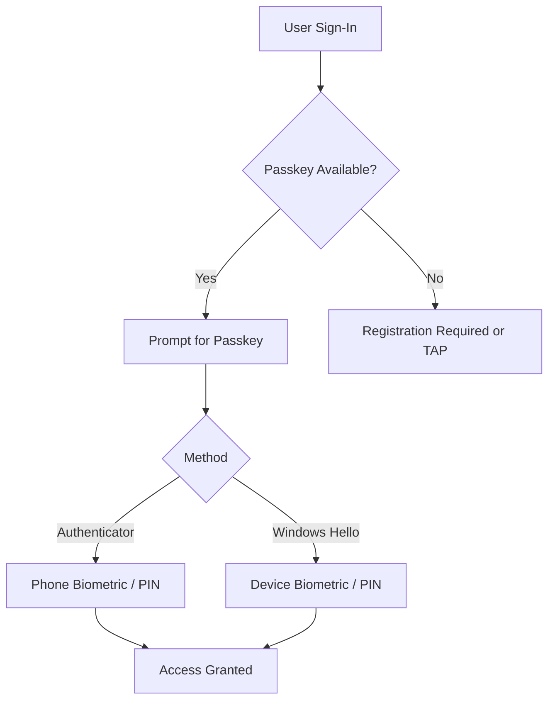

# 🔐 Entra Passwordless Deployment Guide (Passkeys)

> [!TIP]
> Follow this guide step-by-step.  
> Do not enforce policies until validation is complete.

---

## 🧭 Authentication Flow Overview



---

# ⚠️ Before You Start

This guide assumes:

- Global Administrator access
- Break-glass account is configured and excluded
- Users have a supported mobile device for Microsoft Authenticator passkeys  
- Windows Hello for Business is optional but recommended on supported Windows devices  
- Microsoft Authenticator is installed  
- Testing is performed in a controlled environment

# 🧠 Platform Authentication Options

This deployment supports multiple passkey methods:

- Microsoft Authenticator passkeys
- Windows Hello for Business

### Requirement

- Microsoft Authenticator passkeys are supported for this deployment
- Windows Hello for Business is **recommended but not required**

### Why Windows Hello is recommended

Windows Hello provides:

- Device-based passkey authentication
- Better user experience on managed Windows devices
- Redundancy if the user’s phone is unavailable

---

## 🧠 Key Concept

Passkeys provide:

- Phishing-resistant authentication
- Passwordless sign-in
- Device-bound credentials

They satisfy strong authentication requirements without traditional MFA prompts.

---

# ⚙️ Step 1 — Enable Passkeys in Microsoft Entra ID

This step enables passkeys (FIDO2) in Microsoft Entra ID so users can register and use passkeys.

> [!IMPORTANT]
> For this deployment, **Microsoft Authenticator passkeys are the primary required path**.  
> **Windows Hello for Business is recommended but not required**.

Microsoft’s current guidance puts passkey/FIDO2 configuration in Microsoft Entra admin center → Entra ID → Security → Authentication methods → Policies, and enabling passkey profiles moves the global FIDO2 settings into a Default passkey profile. Microsoft also documents passkeys in Authenticator as a supported phishing-resistant authentication method

---

### Option A — GUI (Recommended)

Use the Microsoft Entra admin center to enable passkeys.

#### Prerequisites

- You must sign in with a role that can manage authentication methods, such as:
  - Global Administrator
  - Authentication Policy Administrator

#### Steps

1. Sign in to the **Microsoft Entra admin center**
2. Go to:

   **Entra ID** → **Security** → **Authentication methods** → **Policies**

3. Open the **Passkey (FIDO2)** policy

4. If prompted to enable **passkey profiles**, enable them

   - Microsoft automatically moves existing global FIDO2 settings into the **Default passkey profile**

5. In the passkey profile or policy, set the method to:

   - **Enable**

6. Choose who can use passkeys:

   - **All users**, or
   - **Selected users / groups**

   > Recommended: start with a pilot group first

7. Review optional settings such as:

   - Attestation enforcement
   - Key restrictions / passkey provider restrictions
   - User self-service behavior

8. Save the policy

#### Expected Result

- Passkeys are enabled in the tenant
- Assigned users can register passkeys
- Microsoft Authenticator passkeys can be used for sign-in
- Windows Hello can also be used where supported, but it is optional for this deployment

---

### Option B — PowerShell / Graph

Use this if you want to enable passkeys programmatically.

#### Where to run it

Run this from:

- **PowerShell 7+**
- On an admin workstation
- After connecting to Microsoft Graph with the required scopes

#### Before you run it

Open **PowerShell 7** and connect to Microsoft Graph:

```powershell
Connect-MgGraph -Scopes `
  "Policy.Read.All", `
  "Policy.ReadWrite.AuthenticationMethod"
```


---

# 👤 Step 2 — User Enrollment

Users must enroll in at least one supported passkey method.

### Required for this deployment

#### Microsoft Authenticator

1. Install Microsoft Authenticator  
2. Add work account  
3. Register passkey  
4. Configure biometric or PIN  

### Optional but Recommended

#### Windows Hello for Business

1. Configure Windows Hello for Business  
2. Set PIN or biometric  
3. Register device  

Windows Hello is not required for this deployment, but it is recommended to improve user experience and recovery resilience on Windows devices.

---

# 🧪 Step 3 — Validate Enrollment

Test:

- Sign-in using Authenticator passkey
- Sign-in using Windows Hello
- Confirm no password prompt

---
  
# 🚀 Step 4 — Deploy Conditional Access (Lab)

Run:

```Powershell
.\scripts\11-create-ca-passkey-lab.ps1
```

Expected Result:

- MFA required
- Authenticator allowed
- Windows Hello allowed
- Policy in report-only mode

---
  
# 🧪 Step 5 — Validate Authentication

Test:

- Authenticator passkey login
- Windows Hello login
- Sign-in logs show correct method

---

# 🔐 Step 6 — Deploy Production Policy

Run:

```Powershell
.\scripts\12-create-ca-passkey-production.ps1
```

Expected Result:

- Phishing-resistant authentication enforced
- Password-based login blocked
- Only passkey methods allowed
  
# ✅ What Success Looks Like

- Users sign in without passwords
- Authenticator passkeys work consistently
- Windows Hello works
- Legacy authentication is blocked

# ⚠️ Critical Safety Checks

Before enforcement:

- Users enrolled with passkeys
- Break-glass account verified
- TAP available for recovery
- Policies tested in report-only
  
# 🛟 Recovery Options

If access is lost:

- Temporary Access Pass (TAP)
- Re-register passkey
- Use break-glass account
  
# 🛠️ Troubleshooting

- Passkey not prompting
- Ensure device supports FIDO2
- Verify Authenticator installed
- Check browser compatibility
- Policy not applying
- Review Conditional Access targeting
- Verify group membership
- Login loop
- Check for conflicting policies
- Review session controls
  
# 🧠 Architecture Notes

This deployment is intended for:

Standard Users:
  → Authenticator passkeys
  → Windows Hello

Privileged Users:
  → YubiKey (separate deployment)
  
# ⚡ Best Practices

- Start in report-only mode
- Do not force passkeys immediately
- Always maintain recovery path
- Recommend Windows Hello for redundancy
- Validate user experience before enforcement

# 🧾 Licensing Requirement
- Entra ID P1 required
- Entra ID P2 optional (for risk-based policies)
