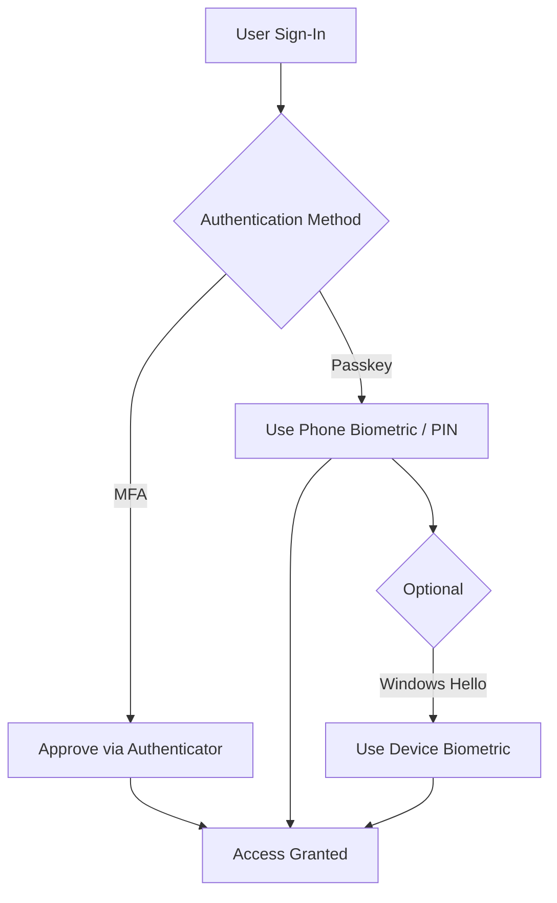

# 🔐 Microsoft Authenticator Enrollment Guide (MFA + Passkeys)

This guide walks you through:

- Setting up Microsoft Authenticator (MFA)
- Registering a passkey (passwordless sign-in)
- Optional Windows Hello setup
- Testing your sign-in

---

## 🧭 Authentication Overview



📱 Step 1 — Install Microsoft Authenticator

Download Microsoft Authenticator:
iPhone → App Store
Android → Google Play
Open the app

🔑 Step 2 — Add Your Work Account

Tap + Add account
Select Work or school account
Choose Scan QR code
Follow sign-in instructions

✅ Expected Result

Your account appears in the app
You can receive sign-in prompts

🔐 Step 3 — Set Up MFA

Sign in to your account
Choose Approve request
Approve notification on your phone

🔁 Manual Setup (if needed)

Go to:
https://mysignins.microsoft.com/security-info
Click Add sign-in method
Select Authenticator app
Scan QR code

🔑 Step 4 — Register a Passkey

Go to:
https://mysignins.microsoft.com/security-info
Click Add sign-in method
Select:
Passkey (preview) or FIDO2 security key
Choose:
Use your phone
Follow prompts:
Approve in Authenticator
Use Face ID / fingerprint / PIN

✅ Expected Result
Passkey is registered
No password required for sign-in

💻 Step 5 — (Optional) Set Up Windows Hello

⚠️ Recommended but not required

Go to:
Settings → Accounts → Sign-in options
Configure:
PIN
Fingerprint or facial recognition

🧪 Step 6 — Test Your Sign-In
✅ Passkey Test (Recommended)

Open a private browser
Sign in to Microsoft 365

Expected:

Passkey prompt appears
Authenticator approval
No password required
✅ MFA Test
Sign in
Approve notification
✅ Windows Hello Test (Optional)
Sign in on device
Use biometric or PIN

⚠️ Troubleshooting

<details> <summary><strong>Click to expand</strong></summary>
No Authenticator prompt
Ensure app is installed
Enable notifications
Confirm account is added
Passkey option missing
Ensure passkeys are enabled by IT
Try again at:
https://mysignins.microsoft.com/security-info
Cannot sign in
Use backup method
Contact IT
</details>

🛟 Recovery Options
Contact IT support
Request Temporary Access Pass (TAP)
Re-register methods
🧠 Key Takeaways
Authenticator is required
Passkeys replace passwords
Windows Hello is optional
Always complete setup
🔐 Security Reminder
Never approve unknown sign-ins
Do not share codes
Report suspicious activity

---

# ✅ 2. QUICK START (ONE-PAGER)

👉 Save as:

```plaintext
docs/platform-passkeys/user-quick-start.md
# 🚀 Quick Start — Microsoft Authenticator & Passkeys

Follow these steps to get secure sign-in working.

---

## 📱 1. Install Authenticator

- Download Microsoft Authenticator  
- Open the app  

---

## 🔑 2. Add Your Account

- Tap **+ Add account**  
- Select **Work or school account**  
- Scan QR code  

---

## 🔐 3. Approve MFA

- Sign in  
- Approve notification on your phone  

---

## 🔑 4. Set Up Passkey (IMPORTANT)

Go to:  
https://mysignins.microsoft.com/security-info  

- Click **Add sign-in method**  
- Select **Passkey**  
- Choose **Use your phone**  
- Approve with Face ID / fingerprint  

---

## 💻 5. (Optional) Windows Hello

- Settings → Accounts → Sign-in options  
- Set up PIN / biometric  

---

## 🧪 6. Test

- Sign in to Microsoft 365  
- Use passkey  
- No password needed  

---

## 🛟 Need Help?

- Contact IT  
- Request Temporary Access Pass (TAP)  

---

## 🔐 Reminder

- Never approve unexpected sign-ins  
- Keep your device secure
```
